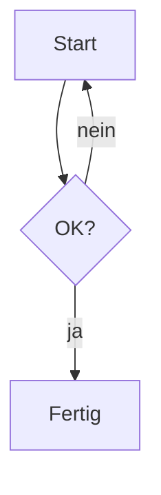
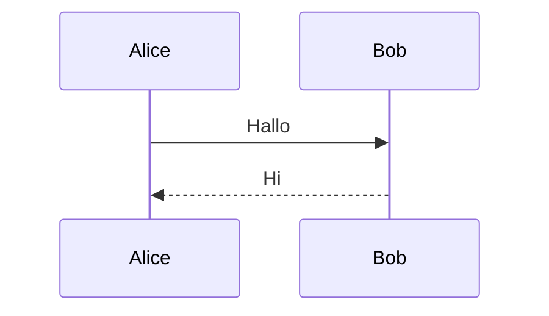

# Dokument mit Diagrammen

Ein Absatz vor dem ersten Diagramm.

## Ablauf


```mermaid
flowchart TD
  Start --> Pruefen{OK?}
  Pruefen -- ja --> Fertig
  Pruefen -- nein --> Start
```

## Sequenz


```mermaid
sequenceDiagram
  Alice->>Bob: Hallo
  Bob-->>Alice: Hi
```

## Fehlerhaft

```mermaid
flowchart LR
  A --> B{{
```

## Normaler Code

```javascript
const x = 1;
```
